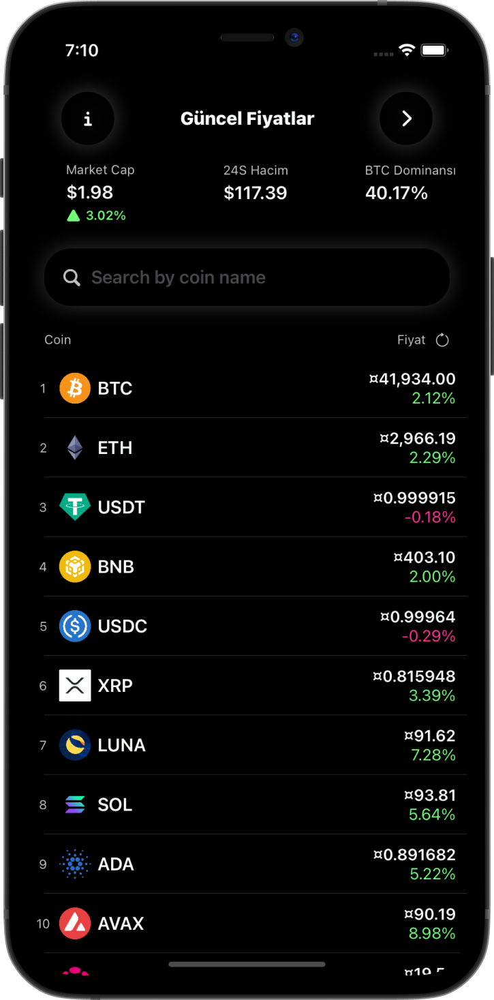

# ByteCoin

This application is a cryptocurrency application that downloads the current prices from a CoinGecko API and uses Core Data to save the current user's portfolio.

### App Features

- Live cryptocurrency data
- Save current user's portfolio
- Search any coin data
- Custom color themes

### Technical Features

- MVVM Architecture
- Core Data for saving current user's portfolio
- Combine for subscribers
- Codable for decoding JSON data
- File and Network Manager
- Multiple API calls

## Screenshots

Some screenshots are below. All screenshots of the application are in the outputs folder.

                                                                                            
                                          
                                            
                                                                                            

